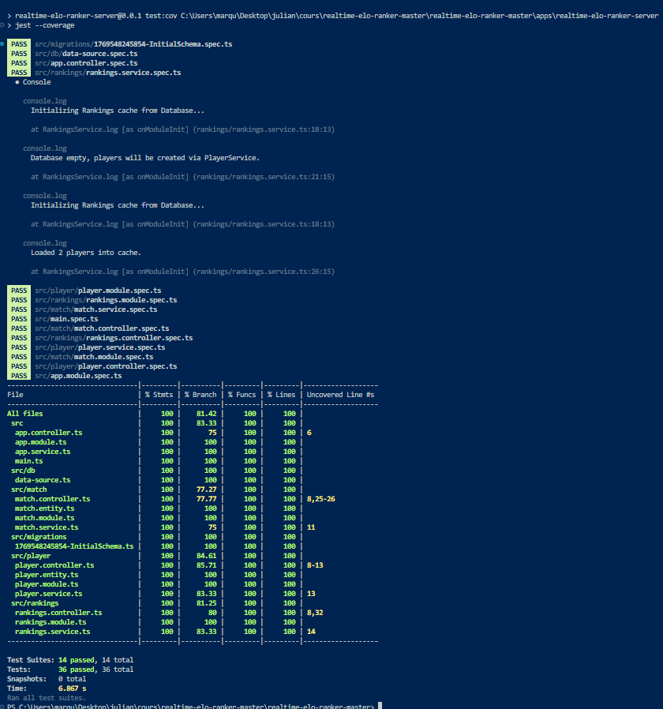

# TP Note JS
Julian Marques  

## Installation du projet   
```bash
git clone https://github.com/julian2bot/realtime-elo-ranker-master.git

cd ./realtime-elo-ranker-master

pnpm install


# Migration joueur / match si aucune migration n'existe
pnpm run apps:server:db:generate -- src/migrations/InitialSchema
pnpm run apps:server:db:migrate

# Sinon, utiliser la migration joueur / match déjà réalisée (meilleure option)
pnpm run apps:server:db:migrate # FAIRE LUI
```  


## Lancer le projet
```bash
# Lancer le client
pnpm run apps:client:dev  # lance sur localhost:3001

# Puis sur un second terminal 

# Lancer le serveur
pnpm run apps:server:dev 

# Puis sur un troisieme terminal

# Lancer le simulator
pnpm run apps:simulator:dev


# s'il y a des erreurs du au chemin absolue / relatif:
clear ; pnpm run final:client
clear ; pnpm run final:server
clear ; pnpm run final:simulator
```

## Objectifs
- [X] Créer un serveur HTTP en utilisant NestJS
- [X] Créer un service de type Singleton pour stocker des données du classement en cache
- [X] Créer un service pour écrire et lire les données des joueurs en base de données
- [X] Ajouter la logique métier pour mettre à jour le classement des joueurs
- [X] Ajouter un EventEmitter pour émettre des notifications en temps réel
- [X] Implémenter l'API décrite par le Swagger fourni
- [X] Tester l'application avec des tests unitaires et des tests d'intégration


## Fonctionnalités

- [X] Un joueur peut etre créer avec un elo initial de qui est la moyen de tous les elos des joueurs existants.
- [X] Un match peut etre créer entre deux joueurs.
- [X] Visualisé les joueurs et leurs elos.
- [X] Un historique des matchs est stocké.
- [X] Les elos des joueurs sont mis à jour en temps réel.
- [X] Les joueurs sont stocké en mémoire cache et en base de données.
- [X] match aleatoire entre deux joueurs toutes les XX secondes.
- [X] Simulation de match.
- [ ] Interface belle et moderne.
- [X] Test  


## Tests  

### lancer les tests  
```bash
# À la racine du projet
clear ; pnpm --filter realtime-elo-ranker-server test
```

### lancer le coverage  
```bash
# À la racine du projet
clear ; pnpm --filter realtime-elo-ranker-server test:cov
```

### Résultats



